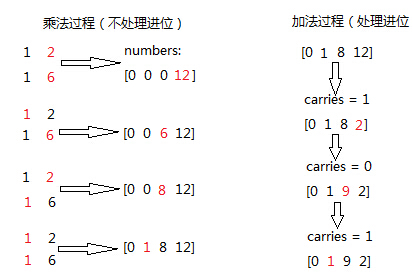

字符串部分
=========

首先从字符串部分开始刷，每刷一题都会记录当时的想法以及用两种脚本语言写出结果。

.. attention::

        因为也是第一次开始干这个事情，很多地方都是需要改进的。慢慢来吧

157. Read N Characters Given Read4 I
------------------------------------

The API: int read4(char *buf) reads 4 characters at a time from a file.
The return value is the actual number of characters read. For example, it returns 3 if there is only 3 characters left in the file.
By using the read4 API, implement the function int read(char *buf, int n) that reads n characters from the file.
Note:
The read function will only be called once for each test case.

首先让我们先把题目看清楚，题目问的是读取一个文件里面的内容，算出总共有多少个字符。简单点来说就是给你一个字符串，有一个函数叫做read4，读n个char到指定的buf去。那么就需要一个char*4的临时buf来储存一次读出来的结果，然后再把这个结果按要求赋给指定的buf，如果比4小的话，就说明字符串快要读完，数字就代表剩下的几个。特么想不通为什么一开始搞一个(char *buf)，让有的人看了一脸懵逼好么。

这道题木有搞明白

158. Read N Characters Given Read4 II - Call multiple times
-----------------------------------------------------------

The API: int read4(char *buf) reads 4 characters at a time from a file.

The return value is the actual number of characters read. For example, it returns 3 if there is only 3 characters left in the file.

By using the read4 API, implement the function int read(char *buf, int n) that reads n characters from the file.

Note:
The read function may be called multiple times.

.. important::

        这道题目跟上面一样没有搞明白

28. Implement strStr()
----------------------

Implement strStr().

Returns the index of the first occurrence of needle in haystack, or -1 if needle is not part of haystack.

还没来得及仔细看答案
https://www.youtube.com/watch?v=GTJr8OvyEVQ

557. Reverse Words in a String III
----------------------------------

Given a string, you need to reverse the order of characters in each word within a sentence while still preserving whitespace and initial word order.

Example 1:
::
        Input: "Let's take LeetCode contest"
        Output: "s'teL ekat edoCteeL tsetnoc"
Note: In the string, each word is separated by single space and there will not be any extra space in the string.

这道题目的理解还是非常简单

JavaScript答案 ::

        var hello = "Let's take LeetCode contest".split(' ').map(s => s.split().reverse().join()).join(' ')
        console.log(hello)

551. Student Attendance Record I
--------------------------------

You are given a string representing an attendance record for a student. The record only contains the following three characters:
::
        'A' : Absent.
        'L' : Late.
        'P' : Present.
A student could be rewarded if his attendance record doesn't contain more than one 'A' (absent) or more than two continuous 'L' (late).

You need to return whether the student could be rewarded according to his attendance record.

Example 1:
::
        Input: "PPALLP"
        Output: True
Example 2:
::
        Input: "PPALLL"
        Output: False

JavaScript答案 ::

        function baby (s) {
                let twoStr = s.split('').sort().join('').toLowerCase().indexOf('aa');
                let oneStr = s.toLowerCase().indexOf('lll');
            
            if( twoStr < 0 && oneStr < 0 ) {
                return true;
            }else{
                return false;
            }
        }
        console.log(baby('ACFHPLLL'))

541. Reverse String II
----------------------

Given a string and an integer k, you need to reverse the first k characters for every 2k characters counting from the start of the string. If there are less than k characters left, reverse all of them. If there are less than 2k but greater than or equal to k characters, then reverse the first k characters and left the other as original.
Example:
::
        Input: s = "abcdefg", k = 2
        Output: "bacdfeg"
Restrictions:
::
        The string consists of lower English letters only.
        Length of the given string and k will in the range [1, 10000]

JavaScript答案 ::

        var reverseStr = function(s, k) {
            var arr = s.split('');
            var i = 0;
            var n = arr.length;
            while(i < n) {
                var j = Math.min(i + k - 1, n - 1);
                reverse(arr,i,j);
                i += 2 * k;
            }
            return arr.join('');
        };
        function reverse(arr,i,j){
            while(i < j) {
                var tmp = arr[i];
                arr[i] = arr[j];
                arr[j] = tmp;
                i++;
                j--;
            }
        }

521. Longest Uncommon Subsequence I
-----------------------------------

Given a group of two strings, you need to find the longest uncommon subsequence of this group of two strings. The longest uncommon subsequence is defined as the longest subsequence of one of these strings and this subsequence should not be any subsequence of the other strings.

A subsequence is a sequence that can be derived from one sequence by deleting some characters without changing the order of the remaining elements. Trivially, any string is a subsequence of itself and an empty string is a subsequence of any string.

The input will be two strings, and the output needs to be the length of the longest uncommon subsequence. If the longest uncommon subsequence doesn't exist, return -1.

Example 1:
::
        Input: "aba", "cdc"
        Output: 3
Explanation: The longest uncommon subsequence is "aba" (or "cdc"), 
because "aba" is a subsequence of "aba", 
but not a subsequence of any other strings in the group of two strings. 
Note:
.. admontion::
        Both strings' lengths will not exceed 100.
        Only letters from a ~ z will appear in input strings.

比较两个字符串的长度，若不相等，则返回长度的较大值，若相等则再判断两个字符串是否相同，若相同则返回-1，否则返回长度。

522. Longest Uncommon Subsequence II
------------------------------------

Given a list of strings, you need to find the longest uncommon subsequence among them. The longest uncommon subsequence is defined as the longest subsequence of one of these strings and this subsequence should not be any subsequence of the other strings.

A subsequence is a sequence that can be derived from one sequence by deleting some characters without changing the order of the remaining elements. Trivially, any string is a subsequence of itself and an empty string is a subsequence of any string.

The input will be a list of strings, and the output needs to be the length of the longest uncommon subsequence. If the longest uncommon subsequence doesn't exist, return -1.

Example 1:
::
        Input: "aba", "cdc", "eae"
        Output: 3
Note:
.. hint ::
        All the given strings' lengths will not exceed 10.
        The length of the given list will be in the range of [2, 50].
题目大意：
给定一组字符串，寻找其最长不公共子序列。最长不公共子序列是指：这组字符串中某一个的子序列，该子序列不是其余任意字符串的子序列，并且长度最长。

子序列是指从一个序列中删除一些字符，剩余字符顺序保持不变得到的新序列。任何字符串都是其本身的子序列，空串不属于任意字符串的子序列。

返回最长不公共子序列，若不存在，返回-1。

Answerone
这道题让找最长的独有子序列，解题思路可以分三步：
1、按照字符串长度降序排列strs
2、遍历strs，如果str不是所有strs的独有子字符串，返回str的长度
3、如果没有找到独有字符串，返回-1

Answertwo
首先将输入字符串列表strs按照长度递减排序，记得到的新列表为slist。

利用计数器cnt统计每个字符串出现的次数。

遍历slist，记当前字符串为c，其下标为i：

    若c在strs中出现不止一次，跳过该字符串

    否则，利用贪心算法对c和slist[0 .. i - 1]的字符串进行匹配，若均匹配失败，则返回len(c)

遍历结束，返回-1

python 
::
        class Solution(object):
            def uncommon(self, parent, child):
                lp, lc = len(parent), len(child)
                pp = pc = 0
                while pp < lp and pc < lc:
                    if parent[pp] == child[pc]:
                        pc += 1
                    pp += 1
                return pc != lc
            def findLUSlength(self, strs):
                """
                :type strs: List[str]
                :rtype: int
                """
                cnt = collections.Counter(strs)
                slist = sorted(set(strs), key=len, reverse=True)
                for i, c in enumerate(slist):
                    if cnt[c] > 1: continue
                    if all(self.uncommon(p, c) for p in slist[:i]):
                        return len(c)
                return -1

13. Roman to Integer
--------------------

Given a roman numeral, convert it to an integer.

Input is guaranteed to be within the range from 1 to 3999.

+-----------------+------+------+------+------+------+------+------+
|  Roman Number   |   I  |  V   |   X  |   L  |   C  |   D  |   M  |  
+-----------------+------+------+------+------+------+------+------+
|  Arab Number    |   1  |  5   |  10  |  50  | 100  |  500 | 1000 |
+-----------------+------+------+------+------+------+------+------+

罗马数字是最早的数字表示方式，比阿拉伯数字早2000多年，起源于罗马。
如今我们最常见的罗马数字就是钟表的表盘符号：Ⅰ，Ⅱ，Ⅲ，Ⅳ（IIII），Ⅴ，Ⅵ，Ⅶ，Ⅷ，Ⅸ，Ⅹ，Ⅺ，Ⅻ……
对应阿拉伯数字（就是现在国际通用的数字），就是1，2，3，4，5，6，7，8，9，10，11，12。（注：阿拉伯数字其实是古代印度人发明的，后来由阿拉伯人传入欧洲，被欧洲人误称为阿拉伯数字。）

1、相同的数字连写，所表示的数等于这些数字相加得到的数，如：Ⅲ = 3；
2、小的数字在大的数字的右边，所表示的数等于这些数字相加得到的数， 如：Ⅷ = 8；Ⅻ = 12；
3、小的数字，（限于Ⅰ、X 和C）在大的数字的左边，所表示的数等于大数减小数得到的数，如：Ⅳ= 4；Ⅸ= 9；
4、正常使用时，连写的数字重复不得超过三次。（表盘上的四点钟“IIII”例外）
5、在一个数的上面画一条横线，表示这个数扩大1000倍。

有几条须注意掌握：

#. 基本数字Ⅰ、X 、C 中的任何一个，自身连用构成数目，或者放在大数的右边连用构成数目，都不能超过三个；放在大数的左边只能用一个。
#. 不能把基本数字V 、L 、D 中的任何一个作为小数放在大数的左边采用相减的方法构成数目；放在大数的右边采用相加的方式构成数目，只能使用一个。
#. V 和X 左边的小数字只能用Ⅰ。
#. L 和C 左边的小数字只能用X。
#. D 和M 左边的小数字只能用C。
 
而这道题好就好在没有让我们来验证输入字符串是不是罗马数字，这样省掉不少功夫。我们需要用到map数据结构，来将罗马数字的字母转化为对应的整数值，因为输入的一定是罗马数字，那么我们只要考虑两种情况即可：
第一，如果当前数字是最后一个数字，或者之后的数字比它小的话，则加上当前数字
第二，其他情况则减去这个数字

考虑到罗马数字转换为阿拉伯数字，相应的阿拉伯数字也可以转换为罗马数字

https://github.com/NachtZ/leetcode/blob/master/13.%20Roman%20to%20Integer.go

https://github.com/NachtZ/leetcode/blob/master/12.%20Integer%20to%20Roman.go

https://github.com/yuguo/LeetCode/blob/master/13.%20Roman%20to%20Integer.js

https://github.com/kamyu104/LeetCode/blob/master/Python/roman-to-integer.py

https://github.com/kamyu104/LeetCode/blob/master/Python/integer-to-roman.py

14. Longest Common Prefix
-------------------------

题目：
Write a function to find the longest common prefix string amongst an array of strings.
::
        function sharedStart(array){
            var A= array.concat().sort(), 
            a1= A[0], a2= A[A.length-1], L= a1.length, i= 0;
            while(i<L && a1.charAt(i)=== a2.charAt(i)) i++;
            return a1.substring(0, i);
        }

sharedStart(['interspecies', 'interstelar', 'interstate'])  //=> 'inters'
sharedStart(['throne', 'throne'])                           //=> 'throne'
sharedStart(['throne', 'dungeon'])                          //=> ''
sharedStart(['cheese'])                                     //=> 'cheese'
sharedStart([])                                             //=> ''
sharedStart(['prefix', 'suffix'])                           //=> ''

520. Detect Capital
-------------------

Given a word, you need to judge whether the usage of capitals in it is right or not.

We define the usage of capitals in a word to be right when one of the following cases holds:

#. All letters in this word are capitals, like "USA".
#. All letters in this word are not capitals, like "leetcode".
#. Only the first letter in this word is capital if it has more than one letter, like "Google".
#. Otherwise, we define that this word doesn't use capitals in a right way.
Example 1:
::
    Input: "USA"
    Output: True
Example 2:
::
    Input: "FlaG"
    Output: False
Note: 

.. admontion ::
The input will be a non-empty word consisting of uppercase and lowercase latin letters.

https://stackoverflow.com/questions/1027224/how-can-i-test-if-a-letter-in-a-string-is-uppercase-or-lowercase-using-javascrip

方法一：
思路：
将单词转换为大写得到up，将单词转换为小写得到low，若word与up或与low相等，则返回true，否则去掉word的首字母得到last，若last转换为小写后仍与last相等，则返回true，否则返回false。

方法二：
思路：
flag为0表示首字母判断，flag为1表示首字母小写，flag为2表示首字母大写，flag为1的情况下，若有大写字母出现则返回false，flag为2的情况下，若有小写字母出现则flag置为3，若有大写字母出现则flag置为4，flag为3的情况下，若有大写字母出现则返回false，flag为4的情况下，若有小写字母出现则返回false。最终返回true。

20. Valid Parentheses
---------------------

Given a string containing just the characters '(', ')', '{', '}', '[' and ']', determine if the input string is valid.

The brackets must close in the correct order, "()" and "()[]{}" are all valid but "(]" and "([)]" are not.

JavaScript
::
        // Time complexity: O(n)
        function isValidParentheses(str) {
            var i = 0, l = str.length, arr = [];
            if (!l) {
                return true;
            }

            if ((l % 2) !== 0) {
                return false;
            }

            while (i < l) {
                var s = str[i];
                if (s == "{") {
                    arr.push(s);
                } else if (s == "}") {
                    if (arr.length) {
                        arr.pop();
                    } else {
                        return false;
                    }
                }
                i++;
            }
            return true;
        }

        isValidParentheses("{{{}}}"); // true
        isValidParentheses("{{}{}}"); // true
        isValidParentheses("{}{{}}"); // true
        isValidParentheses("}{}{"); // false

function validParentheses(parens){
  var Arr=parens.split(""), counter1=0, counter2=0; 
  
  if (Arr[0]===")" || Arr[Arr.length-1]==="("){
  return false;}
  
  for (var i in Arr){
 
    if (Arr[i]=="("){
      counter1++;
    }
    
    if (Arr[i]===")"){
      counter2++;
    }
    
  }
  
  if (counter1===counter2){
    return true;
  }
  
  else return false; 
  
}

str= ")(()))"; 
validParentheses(str);

459. Repeated Substring Pattern
-------------------------------

Given a non-empty string check if it can be constructed by taking a substring of it and appending multiple copies of the substring together. You may assume the given string consists of lowercase English letters only and its length will not exceed 10000.

Example 1:
::
        Input: "abab"
        Output: True

Explanation: It's the substring "ab" twice.
Example 2:
::
        Input: "aba"
        Output: False
Example 3:
::
        Input: "abcabcabcabc"
        Output: True

Explanation: 

.. tip ::
        It's the substring "abc" four times. (And the substring "abcabc" twice.)

606. Construct String from Binary Tree
--------------------------------------

You need to construct a string consists of parenthesis and integers from a binary tree with the preorder traversing way.

The null node needs to be represented by empty parenthesis pair "()". And you need to omit all the empty parenthesis pairs that don't affect the one-to-one mapping relationship between the string and the original binary tree.

Example 1:
:: 
        Input: Binary tree: [1,2,3,4]
               1
             /   \
            2     3
           /    
          4     

        Output: "1(2(4))(3)"

.. hint ::
        Explanation: Originallay it needs to be "1(2(4)())(3()())", 
        but you need to omit all the unnecessary empty parenthesis pairs. 
        And it will be "1(2(4))(3)".

Example 2:
Input: Binary tree: [1,2,3,null,4]
       1
     /   \
    2     3
     \  
      4 

Output: "1(2()(4))(3)"

Explanation: Almost the same as the first example, 
except we can't omit the first parenthesis pair to break the one-to-one mapping relationship between the input and the output.

434. Number of Segments in a String
-----------------------------------

Count the number of segments in a string, where a segment is defined to be a contiguous sequence of non-space characters.

Please note that the string does not contain any non-printable characters.

Example:
:: 
        Input: "Hello, my name is John"
        Output: 5

408. Valid Word Abbreviation
----------------------------

Given a non-empty string s and an abbreviation abbr, return whether the string matches with the given abbreviation.

A string such as "word" contains only the following valid abbreviations:

["word", "1ord", "w1rd", "wo1d", "wor1", "2rd", "w2d", "wo2", "1o1d", "1or1", "w1r1", "1o2", "2r1", "3d", "w3", "4"]
Notice that only the above abbreviations are valid abbreviations of the string "word". Any other string is not a valid abbreviation of "word".

Note:
Assume s contains only lowercase letters and abbr contains only lowercase letters and digits.

Example 1:
::
        Given s = "internationalization", abbr = "i12iz4n":

        Return true.

Example 2:
::
        Given s = "apple", abbr = "a2e":

        Return false.

38. Count and Say
-----------------

The count-and-say sequence is the sequence of integers with the first five terms as following:

1.     1
2.     11
3.     21
4.     1211
5.     111221
1 is read off as "one 1" or 11.
11 is read off as "two 1s" or 21.
21 is read off as "one 2, then one 1" or 1211.
Given an integer n, generate the nth term of the count-and-say sequence.

Note: Each term of the sequence of integers will be represented as a string.

Example 1:

Input: 1
Output: "1"
Example 2:

Input: 4
Output: "1211"

383. Ransom Note
----------------

Given an arbitrary ransom note string and another string containing letters from all the magazines, write a function that will return true if the ransom note can be constructed from the magazines ; otherwise, it will return false.

Each letter in the magazine string can only be used once in your ransom note.

Note:
You may assume that both strings contain only lowercase letters.
::
        canConstruct("a", "b") -> false
        canConstruct("aa", "ab") -> false
        canConstruct("aa", "aab") -> true

345. Reverse Vowels of a String
-------------------------------

Write a function that takes a string as input and reverse only the vowels of a string.

Example 1:
Given s = "hello", return "holle".

Example 2:
Given s = "leetcode", return "leotcede".

Note:
The vowels does not include the letter "y".

344. Reverse String
-------------------

Write a function that takes a string as input and returns the string reversed.

Example:
Given s = "hello", return "olleh".

58. Length of Last Word
-----------------------

Given a string s consists of upper/lower-case alphabets and empty space characters ' ', return the length of last word in the string.

If the last word does not exist, return 0.

Note: A word is defined as a character sequence consists of non-space characters only.

For example, 
::
        Given s = "Hello World",
        return 5.

293. Flip Game
--------------

You are playing the following Flip Game with your friend: Given a string that contains only these two characters: + and -, you and your friend take turns to flip twoconsecutive "++" into "--". The game ends when a person can no longer make a move and therefore the other person will be the winner.

Write a function to compute all possible states of the string after one valid move.

For example, given s = "++++", after one move, it may become one of the following states:

[
  "--++",
  "+--+",
  "++--"
]
 

If there is no valid move, return an empty list [].

67. Add Binary
--------------

Given two binary strings, return their sum (also a binary string).

For example,
a = "11"
b = "1"
Return "100".

125. Valid Palindrome
---------------------

Given a string, determine if it is a palindrome, considering only alphanumeric characters and ignoring cases.

For example,
"A man, a plan, a canal: Panama" is a palindrome.
"race a car" is not a palindrome.

Note:
Have you consider that the string might be empty? This is a good question to ask during an interview.

For the purpose of this problem, we define empty string as valid palindrome.

125. Valid Palindrome
---------------------

Given a string, determine if it is a palindrome, considering only alphanumeric characters and ignoring cases.

For example,
"A man, a plan, a canal: Panama" is a palindrome.
"race a car" is not a palindrome.

Note:
Have you consider that the string might be empty? This is a good question to ask during an interview.

For the purpose of this problem, we define empty string as valid palindrome.

接下来以这一块就是medium类型了
^^^^^^^^^^^^^^^^^^^^^^^^^^

186. Reverse Words in a String II
---------------------------------

Given an input string, reverse the string word by word.
A word is defined as a sequence of non-space characters.

The input string does not contain leading or trailing spaces
and the words are always separated by a single space.

For example,
Given s = "the sky is blue",
return "blue is sky the".

Could you do it in-place without allocating extra space?

这道题让我们翻转一个字符串中的单词，跟之前那题Reverse Words in a String没有区别，由于之前那道题我们就是用in-place的方法做的，而这道题反而更简化了题目，因为不考虑首尾空格了和单词之间的多空格了，方法还是很简单，先把每个单词翻转一遍，再把整个字符串翻转一遍，或者也可以调换个顺序，先翻转整个字符串，再翻转每个单词，

Hints:
Two-pass:
1. reverse all strings:
"the sky is blue" -> "eulb si yks eht"

2. reverse one word:
"eulb si yks eht" -> "blue is sky the"

468. Validate IP Address
------------------------

Write a function to check whether an input string is a valid IPv4 address or IPv6 address or neither.

IPv4 addresses are canonically represented in dot-decimal notation, which consists of four decimal numbers, each ranging from 0 to 255, separated by dots ("."), e.g.,172.16.254.1;

Besides, leading zeros in the IPv4 is invalid. For example, the address 172.16.254.01 is invalid.

IPv6 addresses are represented as eight groups of four hexadecimal digits, each group representing 16 bits. The groups are separated by colons (":"). For example, the address 2001:0db8:85a3:0000:0000:8a2e:0370:7334 is a valid one. Also, we could omit some leading zeros among four hexadecimal digits and some low-case characters in the address to upper-case ones, so 2001:db8:85a3:0:0:8A2E:0370:7334 is also a valid IPv6 address(Omit leading zeros and using upper cases).

However, we don't replace a consecutive group of zero value with a single empty group using two consecutive colons (::) to pursue simplicity. For example, 2001:0db8:85a3::8A2E:0370:7334 is an invalid IPv6 address.

Besides, extra leading zeros in the IPv6 is also invalid. For example, the address 02001:0db8:85a3:0000:0000:8a2e:0370:7334 is invalid.

Note: You may assume there is no extra space or special characters in the input string.

Example 1:
::
        Input: "172.16.254.1"

        Output: "IPv4"

        Explanation: This is a valid IPv4 address, return "IPv4".
Example 2:
::
        Input: "2001:0db8:85a3:0:0:8A2E:0370:7334"

        Output: "IPv6"

        Explanation: This is a valid IPv6 address, return "IPv6".
Example 3:
::
        Input: "256.256.256.256"

        Output: "Neither"

        Explanation: This is neither a IPv4 address nor a IPv6 address.

编写函数，判断给定的IP地址是否为有效的IPv4地址或者Ipv6地址。

Ipv4地址为4个以点分隔的数字，范围0到255，例如172.16.254.1。

此外，Ipv4不允许出现前缀0。例如地址172.16.254.01是无效的。

Ipv6地址为8个以冒号分隔的16进制数字，例如2001:0db8:85a3:0000:0000:8a2e:0370:7334。允许出现前缀0，并且小写字母和大写字母可以同时出现，所以2001:db8:85a3:0:0:8A2E:0370:7334也是有效的IPv6地址。

然而，不允许出现两个连续的冒号。例如2001:0db8:85a3::8A2E:0370:7334是无效的。

此外，IPv6地址中每一个数字的长度不应大于4位，例如02001:0db8:85a3:0000:0000:8a2e:0370:7334是无效的。

注意：你可以假设测试用例中没有额外的空白字符，但是可能会包含一些特殊字符。

 $.validator.addMethod('IP4Checker', function(value) {
            var ip = "^(?:(?:25[0-5]2[0-4][0-9][01]?[0-9][0-9]?)\.){3}" +
                "(?:25[0-5]2[0-4][0-9][01]?[0-9][0-9]?)$";
                return value.match(ip);
            }, 'Invalid IP address');

            $('#form1').validate({
                rules: {
                    ip: {
                        required: true,
                        IP4Checker: true
                    }
                }
            });

//Validation
jQuery.validator.addMethod('validIP', function(value) {
    var split = value.split('.');
    if (split.length != 4) 
        return false;
            
    for (var i=0; i<split.length; i++) {
        var s = split[i];
        if (s.length==0 || isNaN(s) || s<0 || s>255)
            return false;
    }
    return true;
}, ' Invalid IP Address');

.. code-block:: python

    class Solution(object):
        def validIPAddress(self, IP):
            """
            :type IP: str
            :rtype: str
            """
            if self.validIPV4(IP):
                return 'IPv4'
            if self.validIPV6(IP):
                return 'IPv6'
            return 'Neither'

        def validIPV4(self, IP):
            parts = IP.split('.')
            if len(parts) != 4: return False
            for part in parts:
                if not part: return False
                if not part.isdigit(): return False
                if part[0] == '0' and len(part) > 1: return False
                if int(part) > 255: return False
            return True

        def validIPV6(self, IP):
            parts = IP.split(':')
            if len(parts) != 8: return False
            for part in parts:
                if not part: return False
                if len(part) > 4: return False
                if any(c not in string.hexdigits for c in part): return False
            return True

22. Generate Parentheses
------------------------

Given n pairs of parentheses, write a function to generate all combinations of well-formed parentheses.

For example, given n = 3, a solution set is:
::
        [
          "((()))",
          "(()())",
          "(())()",
          "()(())",
          "()()()"
        ]

生成合法的括号对。
这里只需要搞清楚“合法(well-formed)”的概念就行了，那就是
1.左右括号数相等
2.任一位置之前的右括号数不大于左括号数

有了这样两点，那么要生成括号对总数为n的所有可能性的串。就从空字符串开始，按照上面的第二点限制，逐步添加左右括号即可。
当拿到合法的串，长度为k，时，要继续添加一个括号，那么就看这个串如果左括号的数目没有达到n，那就可以在此基础上添加一个左括号；
同时，如果串内右括号数目小于左括号数目的话，还可以在k串上添加一个右括号。
这样遍历了所有长度为k的合法串之后，我们就得到了所有合法的长度为k+1的串。
当我们生成了所有长度为2n的合法串，就得到了答案。

::

        class Solution(object):
            def bfs(self, left, right, depth, n, string, result):
                if depth == 2 * n:
                    result.append(string)
                    return
                if left < n:
                    string += '('
                    self.bfs(left + 1, right, depth + 1, n, string, result)
                    string = string[:len(string) - 1]
                if left > right:
                    string += ')'
                    self.bfs(left, right + 1, depth + 1, n, string, result)
                    string = string[:len(string) - 1]
            def generateParenthesis(self, n):
                """
                :type n: int
                :rtype: List[str]
                """
                result = []
                self.bfs(0, 0, 0, n, '', result)
                return result

647. Palindromic Substrings
---------------------------

Given a string, your task is to count how many palindromic substrings in this string.

The substrings with different start indexes or end indexes are counted as different substrings even they consist of same characters.

Example 1:
Input: "abc"
Output: 3
Explanation: Three palindromic strings: "a", "b", "c".
Example 2:
Input: "aaa"
Output: 6
Explanation: Six palindromic strings: "a", "a", "a", "aa", "aa", "aaa".
Note:
The input string length won't exceed 1000.

http://www.jianshu.com/p/528f34dadbbb

function isPalindrome(s) {
  var rev = s.split("").reverse().join("");
  return s == rev;
}

function longestPalind(s){
  var maxp_length = 0,
      maxp = '';
    
  for(var i=0; i < s.length; i++) {
    var subs = s.substr(i, s.length);
      
    for(var j=subs.length; j>=0; j--) {
      var sub_subs = subs.substr(0, j);
      if (sub_subs.length <= 1)
          continue;
        
      //console.log('checking: '+ sub_subs);
      if (isPalindrome(sub_subs)) {
        //console.log('palindrome: '+ sub_subs);
        if (sub_subs.length > maxp_length) {
            maxp_length = sub_subs.length;
            maxp = sub_subs;
        }
      }
    }
  }
    
  //console.log(maxp_length, maxp);
  return maxp;
}

console.log(longestPalind("abcxyzyxabcdaaa"));

583. Delete Operation for Two Strings
-------------------------------------

Given two words word1 and word2, find the minimum number of steps required to make word1 and word2 the same, where in each step you can delete one character in either string.

Example 1:
Input: "sea", "eat"
Output: 2
Explanation: You need one step to make "sea" to "ea" and another step to make "eat" to "ea".
Note:
The length of given words won't exceed 500.
Characters in given words can only be lower-case letters.

给定单词word1和word2，从word1和/或word2中删去一些字符，使得word1和word2相同，求最少删除的字符数。

注意：

单词长度不超过500
单词只包含小写字母

https://leetcode.com/articles/delete-operation-for-two-strings/

385. Mini Parser
----------------

Given a nested list of integers represented as a string, implement a parser to deserialize it.

Each element is either an integer, or a list -- whose elements may also be integers or other lists.

Note: You may assume that the string is well-formed:

String is non-empty.
String does not contain white spaces.
String contains only digits 0-9, [, - ,, ].
Example 1:

Given s = "324",

You should return a NestedInteger object which contains a single integer 324.
Example 2:

Given s = "[123,[456,[789]]]",

Return a NestedInteger object containing a nested list with 2 elements:

1. An integer containing value 123.
2. A nested list containing two elements:
    i.  An integer containing value 456.
    ii. A nested list with one element:
         a. An integer containing value 789.

43. Multiply Strings
--------------------

Given two non-negative integers num1 and num2 represented as strings, return the product of num1 and num2.

Note:

The length of both num1 and num2 is < 110.
Both num1 and num2 contains only digits 0-9.
Both num1 and num2 does not contain any leading zero.
You must not use any built-in BigInteger library or convert the inputs to integer directly.

这道题目相关联的题目有
43 Multiply Strings
50 Pow(x, n)
65 Valid Number
66 Plus One
67 Add Binary
149 Max Points on a Line
166 Fraction to Recurring Decimal
168 Excel Sheet Column Title
171 Excel Sheet Column Number
172 Factorial Trailing Zeroes
179 Largest Number
224 Basic Calculator
227 Basic Calculator II
233 Number of Digit One
258 Add Digits
273 Integer to English Words
题解：就是让实现一个大整数乘法。

假设两个数num1和num2的长度分别是len1和len2，那么最后得到的答案，在最高位有进位的时候，就是len1+len2位，否则是len1+len2-1位。我们用数组numbers[len1+len2]存放最后的结果。

很关键的一点就是在做每位之间的乘法的时候不要处理进位，在做加法的时候同一处理进位。

::
        class Solution:
            # @param num1, a string
            # @param num2, a string
            # @return a string
            def multiply(self, num1, num2):
                if num1=='0' or num2=='0':   return '0'
                n,m = len(num1),len(num2)
                num1 ,num2 = num1[::-1] , num2[::-1]
                res=[0]*(n+m)
                for i in range(0,n):
                    id = i 
                    for j in range(0,m):
                        res[id] ,id = res[id]+int(num1[i]) * int(num2[j]),id+1
                carry = 0
                for i in range(0,n+m):
                    res[i] , carry =(res[i]+carry) % 10,(res[i]+carry) /10 
                ans=""
                for i in xrange(n+m-1,-1,-1):   ans += str(res[i])                        
                for i in range(n+m):
                    if ans[i] != '0':   break
                return ans[i:]
class Solution:
    # @param num1, a string
    # @param num2, a string
    # @return a string
    def multiply(self, num1, num2):
        num1 = num1[::-1]; num2 = num2[::-1]
        arr = [0 for i in range(len(num1)+len(num2))]
        for i in range(len(num1)):
            for j in range(len(num2)):
                arr[i+j] += int(num1[i]) * int(num2[j])
        ans = []
        for i in range(len(arr)):
            digit = arr[i] % 10
            carry = arr[i] / 10
            if i < len(arr)-1:
                arr[i+1] += carry
            ans.insert(0, str(digit))
        while ans[0] == '0' and len(ans) > 1:
            del ans[0]
        return ''.join(ans)

