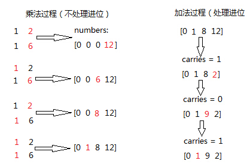

字符串部分
=========

首先从字符串部分开始刷，每刷一题都会记录当时的想法以及用两种脚本语言写出结果。

.. attention::

        因为也是第一次开始干这个事情，很多地方都是需要改进的。慢慢来吧

385. Mini Parser
----------------

Given a nested list of integers represented as a string, implement a parser to deserialize it.

Each element is either an integer, or a list -- whose elements may also be integers or other lists.

Note: You may assume that the string is well-formed:

String is non-empty.
String does not contain white spaces.
String contains only digits 0-9, [, - ,, ].
Example 1:

Given s = "324",

You should return a NestedInteger object which contains a single integer 324.
Example 2:

Given s = "[123,[456,[789]]]",

Return a NestedInteger object containing a nested list with 2 elements:

1. An integer containing value 123.
2. A nested list containing two elements:
    i.  An integer containing value 456.
    ii. A nested list with one element:
         a. An integer containing value 789.

43. Multiply Strings
--------------------

Given two non-negative integers num1 and num2 represented as strings, return the product of num1 and num2.

Note:

The length of both num1 and num2 is < 110.
Both num1 and num2 contains only digits 0-9.
Both num1 and num2 does not contain any leading zero.
You must not use any built-in BigInteger library or convert the inputs to integer directly.

这道题目相关联的题目有
43 Multiply Strings
50 Pow(x, n)
65 Valid Number
66 Plus One
67 Add Binary
149 Max Points on a Line
166 Fraction to Recurring Decimal
168 Excel Sheet Column Title
171 Excel Sheet Column Number
172 Factorial Trailing Zeroes
179 Largest Number
224 Basic Calculator
227 Basic Calculator II
233 Number of Digit One
258 Add Digits
273 Integer to English Words
题解：就是让实现一个大整数乘法。

假设两个数num1和num2的长度分别是len1和len2，那么最后得到的答案，在最高位有进位的时候，就是len1+len2位，否则是len1+len2-1位。我们用数组numbers[len1+len2]存放最后的结果。

很关键的一点就是在做每位之间的乘法的时候不要处理进位，在做加法的时候同一处理进位。

::
        class Solution:
            # @param num1, a string
            # @param num2, a string
            # @return a string
            def multiply(self, num1, num2):
                if num1=='0' or num2=='0':   return '0'
                n,m = len(num1),len(num2)
                num1 ,num2 = num1[::-1] , num2[::-1]
                res=[0]*(n+m)
                for i in range(0,n):
                    id = i 
                    for j in range(0,m):
                        res[id] ,id = res[id]+int(num1[i]) * int(num2[j]),id+1
                carry = 0
                for i in range(0,n+m):
                    res[i] , carry =(res[i]+carry) % 10,(res[i]+carry) /10 
                ans=""
                for i in xrange(n+m-1,-1,-1):   ans += str(res[i])                        
                for i in range(n+m):
                    if ans[i] != '0':   break
                return ans[i:]
class Solution:
    # @param num1, a string
    # @param num2, a string
    # @return a string
    def multiply(self, num1, num2):
        num1 = num1[::-1]; num2 = num2[::-1]
        arr = [0 for i in range(len(num1)+len(num2))]
        for i in range(len(num1)):
            for j in range(len(num2)):
                arr[i+j] += int(num1[i]) * int(num2[j])
        ans = []
        for i in range(len(arr)):
            digit = arr[i] % 10
            carry = arr[i] / 10
            if i < len(arr)-1:
                arr[i+1] += carry
            ans.insert(0, str(digit))
        while ans[0] == '0' and len(ans) > 1:
            del ans[0]
        return ''.join(ans)

616. Add Bold Tag in String
---------------------------

Given a string s and a list of strings dict, you need to add a closed pair of bold tag <b> and </b> to wrap the substrings in s that exist in dict. If two such substrings overlap, you need to wrap them together by only one pair of closed bold tag. Also, if two substrings wrapped by bold tags are consecutive, you need to combine them.

Example 1:

Input: 
s = "abcxyz123"
dict = ["abc","123"]
Output:
"<b>abc</b>xyz<b>123</b>"
Example 2:

Input: 
s = "aaabbcc"
dict = ["aaa","aab","bc"]
Output:
"<b>aaabbc</b>c"
Note:

The given dict won't contain duplicates, and its length won't exceed 100.
All the strings in input have length in range [1, 1000].

题目大意：
给定字符串s和一组字符串dict，在s中寻找在dict中出现过的子串，并在其首位添加加粗标签。

如果两个子串相互重叠或者首位相连，将加粗标签进行合并。

1. colored数组记录s中是否包含dict中字符串，若包含，将对应位置为'1'，否则为'0'
2. 使用KMP字符串匹配算法找出s中包含的dict中字符串的所有位置，将对应colored置为'1'
3. 将colored中连续1用<b></b>包围
   
https://leetcode.com/articles/add-bold-tag-in-a-string/

::
        class Solution(object):
            def addBoldTag(self, s, dict):
                """
                :type s: str
                :type dict: List[str]
                :rtype: str
                """
                start = end = -1
                ans = ''
                for x, c in enumerate(s):
                    nend = 0
                    for d in dict:
                        if s[x:].startswith(d):
                            nend = max(nend, len(d))
                    if nend:
                        if start == -1: start = x
                        end = max(end, nend + x)
                        continue
                    if x >= end:
                        ans += '<b>' + s[start:end] + '</b>'
                        start = end = -1
                    if start == -1: ans += c
                if start > -1: ans += '<b>' + s[start:end] + '</b>'
                return ans

49. Group Anagrams
------------------

Given an array of strings, group anagrams together.

For example, given: ["eat", "tea", "tan", "ate", "nat", "bat"], 
Return:
::
        [
          ["ate", "eat","tea"],
          ["nat","tan"],
          ["bat"]
        ]
Note: All inputs will be in lower-case.

解法

这道题目的关键之处，其实就是怎么样判断两个字符串拥有相同的“字符集”，这样类型的判断通常有两种方法：

一种是对任意两个字符串进行比较，判断他们的字符集是否相同。这样的方法适用于字符串数量较小的情况
而第二种方法就是求出每个字符串的字符集，然后将所有字符串按照它们的字符集进行排序，这样拥有相同字符集的字符串就会处于相邻的位置。这样的方法适用于字符集较小的情况。
在这里，我们不难发现，第二种方法会更适用于这道题目。值得一提的是，第二种做法中求出每个字符串的字符集，实际上就是一种Hash策略（即对一个物体计算一个方便使用的数值来代表这个物体，并且拥有相同特性的物品计算出的数值会一定程度上相同，于是就可以利用这个数值来找到类似的物体），这也就是为什么Hash是这道题的标签之一的原因。

那么接下来只需要解决一些小的问题：

如何求每个字符串的字符集（即Hash值）：这个问题的解决方法有很多种，笔者建议采取的是同样计算为一个字符串，这个字符串和原本字符串的组成字符是相同的，不过在内部所有字符都按照非递减的顺序排序，这样一方面容易求解，另外一方面也能够确保每个字符串的Hash值是唯一的。
不要忘记题目要求的每个由拥有相同“字符集”的字符串组成的集合内部也要按照字典序进行排序。
综上所述，这道题可以得到非常好的解决~当然，对于Hash值或者排序的方面还存在着一些可能的优化，这就有待读者自己去思考啦！

判断两个词是否是变形词，最简单的方法是将两个词按字母排序，看结果是否相同。这题中我们要将所有同为一个变形词词根的词归到一起，最快的方法则是用哈希表。所以这题就是结合哈希表和排序。我们将每个词排序后，根据这个键值，找到哈希表中相应的列表，并添加进去。为了满足题目字母顺序的要求，我们输出之前还要将每个列表按照内部的词排序一下。可以直接用Java的Collections.sort()这个API。

6. ZigZag Conversion
--------------------

The string "PAYPALISHIRING" is written in a zigzag pattern on a given number of rows like this: (you may want to display this pattern in a fixed font for better legibility)

P   A   H   N
A P L S I I G
Y   I   R
And then read line by line: "PAHNAPLSIIGYIR"
Write the code that will take a string and make this conversion given a number of rows:

string convert(string text, int nRows);
convert("PAYPALISHIRING", 3) should return "PAHNAPLSIIGYIR".

https://skyyen999.gitbooks.io/-leetcode-with-javascript/content/questions/6md.html

convert("PAYPALISHIRING", 3)
P   A   H   N
A P L S I I G
Y   I   R

convert("PAYPALISHIRING", 4)
P   I   N
A L S I G
Y A H R
P   I

P   I   N
A   S   G
Y   H
P   I
A   R
L   I

https://github.com/duteng/leetcode/tree/master/Algorithms/ZigZag%20Conversion

556. Next Greater Element III
-----------------------------

Given a positive 32-bit integer n, you need to find the smallest 32-bit integer which has exactly the same digits existing in the integer n and is greater in value than n. If no such positive 32-bit integer exists, you need to return -1.

Example 1:
Input: 12
Output: 21
Example 2:
Input: 21
Output: -1

给定一个32位正整数n，寻找大于n，并且所含数字与n中各位数字相等的最小32位正整数。若不存在，返回-1。

::
        class Solution(object):
            def nextGreaterElement(self, n):
                """
                :type n: int
                :rtype: int
                """
                nums = list(str(n))
                size = len(nums)
                for x in range(size - 1, -1, -1):
                    if nums[x - 1] < nums[x]:
                        break
                if x > 0:
                    for y in range(size - 1, -1, -1):
                        if nums[y] > nums[x - 1]:
                            nums[x - 1], nums[y] = nums[y], nums[x - 1]
                            break
                for z in range((size - x) / 2):
                    nums[x + z], nums[size - z - 1] = nums[size - z - 1], nums[x + z]
                ans = int(''.join(nums))
                return n < ans <= 0x7FFFFFFF and ans or -1

555. Split Assembled Strings
----------------------------

Given a list of strings, you could assemble these strings together into a loop. Among all the possible loops, you need to find the lexicographically biggest string after cutting and making one breakpoint of the loop, which will make a looped string into a regular one.

So, to find the lexicographically biggest string, you need to experience two phases:

Assemble all the strings into a loop, where you can reverse some strings or not and connect them in the same order as given.
Cut and make one breakpoint in any place of the loop, which will make a looped string into a regular string starting from the character at the cutting point.
And your job is to find the lexicographically biggest one among all the regular strings.

Example:

Input: "abc", "xyz"
Output: "zyxcba"
Explanation: You can get the looped string "-abcxyz-", "-abczyx-", "-cbaxyz-", "-cbazyx-", 
where '-' represents the looped status. 
The answer string came from the third looped one, 
where you could cut from the middle and get "zyxcba".
Note:

The input strings will only contain lowercase letters.
The total length of all the strings will not over 1000.

这道题的意思是给你一串字符串，你需要把所有子字符串连接在一起。在连接的时候，可以选的反转或者不翻转这个子字符串。这时你有一个长的字符串，这叫一个loop，你可以rotate他来找俺字典排序最大的那个长字符串。解题思路分两步：
1、遍历字符串数组，如果反转的字符串大于当前子字符串，把当前子字符串变成反转的字符串。
2、遍历字符串数组，取得当前字符串和当前字符串的反转字符串，分别比较以当前字符串或者当前字符串的反转字符串为rotate节点的长字符串，取最大的。
在第二步的时候可以做优化，如果节点第一个字母小于之前的最大长字符串第一个字母，则可以不比较。代码如下：

553. Optimal Division
---------------------

Given a list of positive integers, the adjacent integers will perform the float division. For example, [2,3,4] -> 2 / 3 / 4.

However, you can add any number of parenthesis at any position to change the priority of operations. You should find out how to add parenthesis to get the maximum result, and return the corresponding expression in string format. Your expression should NOT contain redundant parenthesis.

Example:
Input: [1000,100,10,2]
Output: "1000/(100/10/2)"
Explanation:
1000/(100/10/2) = 1000/((100/10)/2) = 200
However, the bold parenthesis in "1000/((100/10)/2)" are redundant, 
since they don't influence the operation priority. So you should return "1000/(100/10/2)". 

Other cases:
1000/(100/10)/2 = 50
1000/(100/(10/2)) = 50
1000/100/10/2 = 0.5
1000/100/(10/2) = 2
Note:

The length of the input array is [1, 10].
Elements in the given array will be in range [2, 1000].
There is only one optimal division for each test case.

这道题给了我们一个数组，让我们确定除法的顺序，从而得到值最大的运算顺序，并且不能加多余的括号。刚开始博主没看清题，以为是要返回最大的值，就直接写了个递归的暴力搜索的方法，结果发现是要返回带括号的字符串，尝试的修改了一下，觉得挺麻烦。于是直接放弃抵抗，上网参考大神们的解法，结果大吃一惊，这题原来还可以这么解，完全是数学上的知识啊，太tricky了。数组中n个数字，如果不加括号就是：

x1 / x2 / x3 / ... / xn

那么我们如何加括号使得其值最大呢，那么就是将x2后面的除数都变成乘数，比如只有三个数字的情况 a / b / c，如果我们在后两个数上加上括号 a / (b / c)，实际上就是a / b * c。而且b永远只能当除数，a也永远只能当被除数。同理，x1只能当被除数，x2只能当除数，但是x3之后的数，只要我们都将其变为乘数，那么得到的值肯定是最大的，所以就只有一种加括号的方式，即:

x1 / (x2 / x3 / ... / xn)

这样的话就完全不用递归了，这道题就变成了一个道简单的字符串操作的题目了，这思路，博主服了，参见代码如下：

解法I 数学

在不添加任何括号的情况下：

a / b / c / d / ... = a / (b * c * d * ...)
在算式中添加括号会使得被除数和除数的构成发生变化

但无论括号的位置如何，a一定是被除数的一部分，b一定是除数的一部分

原式添加括号方案的最大值，等价于求除数的最小值

因此最优添加括号方案为：

a / (b / c / d / ...) = a * c * d * ... / b

271. Encode and Decode Strings
------------------------------
Design an algorithm to encode a list of strings to a string. The encoded string is then sent over the network and is decoded back to the original list of strings.

Machine 1 (sender) has the function:
string encode(vector<string> strs) { // ... your code return encoded_string; } 
Machine 2 (receiver) has the function: 
vector<string> decode(string s) { //... your code return strs; }

So Machine 1 does:
string encoded_string = encode(strs); 
and Machine 2 does:
vector<string> strs2 = decode(encoded_string); 
strs2 in Machine 2 should be the same as strs in Machine 1.

Implement the encode and decode methods.

Note: The string may contain any possible characters out of 256 valid ascii characters. Your algorithm should be generalized enough to work on any possible characters. Do not use class member/global/static variables to store states. Your encode and decode algorithms should be stateless. Do not rely on any library method such as eval or serialize methods. You should implement your own encode/decode algorithm.

本题难点在于如何在合并后的字符串中，区分出原来的每一个子串。这里我采取的编码方式，是将每个子串的长度先赋在前面，然后用一个#隔开长度和子串本身。这样我们先读出长度，就知道该读取多少个字符作为子串了。

249. Group Shifted Strings
--------------------------

Given a string, we can "shift" each of its letter to its successive letter, for example: "abc"
-> "bcd". We can keep "shifting" which forms the sequence:

"abc" -> "bcd" -> ... -> "xyz"
Given a list of strings which contains only lowercase alphabets, group all strings that belong to the same shifting sequence.

For example, given: ["abc", "bcd", "acef", "xyz", "az", "ba", "a", "z"], 
Return:

[
  ["abc","bcd","xyz"],
  ["az","ba"],
  ["acef"],
  ["a","z"]
]

https://zhuanlan.zhihu.com/p/25865748

227. Basic Calculator II
------------------------

Implement a basic calculator to evaluate a simple expression string.

The expression string contains only non-negative integers, +, -, *, / operators and empty spaces . The integer division should truncate toward zero.

You may assume that the given expression is always valid.

Some examples:
"3+2*2" = 7
" 3/2 " = 1
" 3+5 / 2 " = 5
Note: Do not use the eval built-in library function.

Credits:
Special thanks to @ts for adding this problem and creating all test cases.

实现一个简易计算器，计算简单表达式字符串的值。

表达式字符串只包含非负整数， +， -， *， / 运算和空白字符。整数除法的得数应当舍去小数部分。

你可以假设给定的表达式总是有效的。

测试样例见题目描述。

注意：不要使用内置的库函数eval。

http://www.cnblogs.com/grandyang/p/4601208.html

http://wdxtub.com/interview/14520606685216.html

https://siddontang.gitbooks.io/leetcode-solution/content/string/basic_calculator_2.html

https://segmentfault.com/a/1190000003796804

http://www.tangjikai.com/algorithms/leetcode-224-basic-calculator

http://eugeneyang.com/2016/04/21/Basic%20Calculator%20II%20-%20%E5%9F%BA%E6%9C%AC%E8%AE%A1%E7%AE%97%E5%99%A8II/

8. String to Integer (atoi)
---------------------------

Implement atoi to convert a string to an integer.

Hint: Carefully consider all possible input cases. If you want a challenge, please do not see below and ask yourself what are the possible input cases.

Notes: It is intended for this problem to be specified vaguely (ie, no given input specs). You are responsible to gather all the input requirements up front.

Update (2015-02-10):
The signature of the C++ function had been updated. If you still see your function signature accepts a const char * argument, please click the reload button  to reset your code definition.

spoilers alert... click to show requirements for atoi.

Requirements for atoi:
The function first discards as many whitespace characters as necessary until the first non-whitespace character is found. Then, starting from this character, takes an optional initial plus or minus sign followed by as many numerical digits as possible, and interprets them as a numerical value.

The string can contain additional characters after those that form the integral number, which are ignored and have no effect on the behavior of this function.

If the first sequence of non-whitespace characters in str is not a valid integral number, or if no such sequence exists because either str is empty or it contains only whitespace characters, no conversion is performed.

If no valid conversion could be performed, a zero value is returned. If the correct value is out of the range of representable values, INT_MAX (2147483647) or INT_MIN (-2147483648) is returned.

字符串转为整数是很常用的一个函数，由于输入的是字符串，所以需要考虑的情况有很多种。我之前有一篇文章是关于验证一个字符串是否为数字的，参见 http://www.cnblogs.com/grandyang/p/4084408.html 。在那篇文章中，详细的讨论了各种情况，包括符号，自然数，小数点的出现位置，判断他们是否是数字。个人以为这道题也应该有这么多种情况。但是这题只需要考虑数字和符号的情况：

1. 若字符串开头是空格，则跳过所有空格，到第一个非空格字符，如果没有，则返回0.

2. 若第一个非空格字符是符号+/-，则标记sign的真假，这道题还有个局限性，那就是在c++里面，+-1和-+1都是认可的，都是-1，而在此题里，则会返回0.

3. 若下一个字符不是数字，则返回0. 完全不考虑小数点和自然数的情况，不过这样也好，起码省事了不少。

4. 如果下一个字符是数字，则转为整形存下来，若接下来再有非数字出现，则返回目前的结果。

5. 还需要考虑边界问题，如果超过了整形数的范围，则用边界值替代当前值。
   

我估计没有多少人不看下面的要求就通过的吧！

这道题要求的 atoi 跟C++实现的不一样吧，比如我以为不符合要求的返回-1，而这道题要求返回0。

所以，有必要解释一下题目的要求：

1. 首先需要丢弃字符串前面的空格；

2. 然后可能有正负号（注意只取一个，如果有多个正负号，那么说这个字符串是无法转换的，返回0。比如测试用例里就有个“+-2”）；

3. 字符串可以包含0~9以外的字符，如果遇到非数字字符，那么只取该字符之前的部分，如“-00123a66”返回为“-123”；

4. 如果超出int的范围，返回边界值（2147483647或-2147483648）。

综上，要求还是有点怪的，不看要求是很难写对的，看了也不一定理解的对。

635. Design Log Storage System
------------------------------

You are given several logs that each log contains a unique id and timestamp. Timestamp is a string that has the following format: Year:Month:Day:Hour:Minute:Second, for example, 2017:01:01:23:59:59. All domains are zero-padded decimal numbers.

Design a log storage system to implement the following functions:

void Put(int id, string timestamp): Given a log's unique id and timestamp, store the log in your storage system.

int[] Retrieve(String start, String end, String granularity): Return the id of logs whose timestamps are within the range from start to end. Start and end all have the same format as timestamp. However, granularity means the time level for consideration. For example, start = "2017:01:01:23:59:59", end = "2017:01:02:23:59:59", granularity = "Day", it means that we need to find the logs within the range from Jan. 1st 2017 to Jan. 2nd 2017.

Example 1:

put(1, "2017:01:01:23:59:59");
put(2, "2017:01:01:22:59:59");
put(3, "2016:01:01:00:00:00");
retrieve("2016:01:01:01:01:01","2017:01:01:23:00:00","Year"); // return [1,2,3], because you need to return all logs within 2016 and 2017.
retrieve("2016:01:01:01:01:01","2017:01:01:23:00:00","Hour"); // return [1,2], because you need to return all logs start from 2016:01:01:01 to 2017:01:01:23, where log 3 is left outside the range.
Note:

There will be at most 300 operations of Put or Retrieve.
Year ranges from [2000,2017]. Hour ranges from [00,23].
Output for Retrieve has no order required.

日志系统中：

时间戳应该存储为某一起始时间点（例如1970年1月1日0时0分0秒）以来的秒数。这样字符型的时间戳被转化为整型，便于存储和查询。
时间戳连同日志记录的id，以及其他信息作为一个节点存储在特定数据结构中（链表或者搜索树）。

设计一个日志系统，该系统有两个操作，put(id,timestamp)把timestamp时刻的日志id放到日志系统中，retrieve(start,end,gra)从系统中取出timestamp范围在[start,end]之间的日志id，时间的粒度是gra。

我设计的系统是这样的，为了方便retrieve，系统中的日志都按timestamp排序了。有趣的是，在zero-padded（每部分不足补前导0）的情况下，timestamp的字符串排序就是timestamp表示的时间的排序。

定义一个Node结构体，保持一个日志，信息包括日志id和timestamp。用一个链表存储所有Node，并且当新Node插入时，采用插入排序的方法使得链表始终有序。

retrieve的时候，根据粒度，重新设置start和end，比如样例中粒度为Year时，把start改为Year固定，其他时间最小

"2016:00:00:00:00:00"
把end改为Year固定，其他时间最大

"2017:12:31:23:59:59"
这样我只需要遍历链表，把所有timestamp字符串在这个范围内的日志id取出来就好了。其他粒度也是类似的。

165. Compare Version Numbers
----------------------------

Compare two version numbers version1 and version2.
If version1 > version2 return 1, if version1 < version2 return -1, otherwise return 0.

You may assume that the version strings are non-empty and contain only digits and the . character.
The . character does not represent a decimal point and is used to separate number sequences.
For instance, 2.5 is not "two and a half" or "half way to version three", it is the fifth second-level revision of the second first-level revision.

Here is an example of version numbers ordering:

0.1 < 1.1 < 1.2 < 13.37
Credits:
Special thanks to @ts for adding this problem and creating all test cases.

https://segmentfault.com/a/1190000003803133

https://skyyen999.gitbooks.io/-leetcode-with-javascript/content/questions/165md.html

161. One Edit Distance
----------------------

Given two strings S and T, determine if they are both one edit distance apart.

https://nb4799.neu.edu/wordpress/?p=2217

https://tonycao.gitbooks.io/leetcode-locked/content/LeetCode%20Locked/c1.9.html

544. Output Contest Matches
---------------------------

During the NBA playoffs, we always arrange the rather strong team to play with the rather weak team, like make the rank 1 team play with the rank nth team, which is a good strategy to make the contest more interesting. Now, you're given n teams, you need to output their final contest matches in the form of a string.

The n teams are given in the form of positive integers from 1 to n, which represents their initial rank. (Rank 1 is the strongest team and Rank n is the weakest team.) We'll use parentheses('(', ')') and commas(',') to represent the contest team pairing - parentheses('(' , ')') for pairing and commas(',') for partition. During the pairing process in each round, you always need to follow the strategy of making the rather strong one pair with the rather weak one.

Example 1:

Input: 2
Output: (1,2)
Explanation: 
Initially, we have the team 1 and the team 2, placed like: 1,2.
Then we pair the team (1,2) together with '(', ')' and ',', which is the final answer.
 

Example 2:

Input: 4
Output: ((1,4),(2,3))
Explanation: 
In the first round, we pair the team 1 and 4, the team 2 and 3 together, as we need to make the strong team and weak team together.
And we got (1,4),(2,3).
In the second round, the winners of (1,4) and (2,3) need to play again to generate the final winner, so you need to add the paratheses outside them.
And we got the final answer ((1,4),(2,3)).
 

Example 3:

Input: 8
Output: (((1,8),(4,5)),((2,7),(3,6)))
Explanation: 
First round: (1,8),(2,7),(3,6),(4,5)
Second round: ((1,8),(4,5)),((2,7),(3,6))
Third round: (((1,8),(4,5)),((2,7),(3,6)))
Since the third round will generate the final winner, you need to output the answer (((1,8),(4,5)),((2,7),(3,6))).
 

Note:

The n is in range [2, 212].
We ensure that the input n can be converted into the form 2k, where k is a positive integer.

这道题讲的是NBA的季后赛对战顺序，对于一个看了十几年NBA的老粉来说，再熟悉不过了。这种对战顺序是为了避免强强之间过早对决，从而失去比赛的公平性，跟欧冠欧联那种八强就开始随机抽签匹配有本质上的区别。NBA的这种比赛机制基本弱队很难翻身，假如你是拿到最后一张季后赛门票进的，那么一上来就干联盟第一，肯定凶多吉少，很有可能就被横扫了。但是偶尔也会出现黑八的情况，但都是极其少见的，毕竟像勇士这么叼的球队毕竟不多。好了，不闲扯了，来做题吧。我们就拿NBA这种八个球队的情况来分析吧，八只球队的排名是按常规赛胜率来排的：

1 2 3 4 5 6 7 8

因为是最强和最弱来对决，其次是次强与次弱对决，以此类推可得到：

1-8  2-7  3-6  4-5

那么接下来呢，还是最强与最弱，次强与次弱这种关系：

(1-8  4-5)  (2-7  3-6)

最后胜者争夺冠军

((1-8  4-5)  (2-7  3-6))

这样一分析是不是就清楚了呢，由于n限定了是2的次方数，那么就是可以一直对半分的，比如开始有n队，第一拆分为n/2对匹配，然后再对半拆，就是n/2/2，直到拆到n为1停止，而且每次都是首与末配对，次首与次末配对，这样搞清楚了规律，代码应该就不难写了吧，参见代码如下：

https://wormtooth.com/20170318-leetcode-contest24/

609. Find Duplicate File in System
----------------------------------

Given a list of directory info including directory path, and all the files with contents in this directory, you need to find out all the groups of duplicate files in the file system in terms of their paths.

A group of duplicate files consists of at least two files that have exactly the same content.

A single directory info string in the input list has the following format:

"root/d1/d2/.../dm f1.txt(f1_content) f2.txt(f2_content) ... fn.txt(fn_content)"

It means there are n files (f1.txt, f2.txt ... fn.txt with content f1_content, f2_content ... fn_content, respectively) in directory root/d1/d2/.../dm. Note that n >= 1 and m >= 0. If m = 0, it means the directory is just the root directory.

The output is a list of group of duplicate file paths. For each group, it contains all the file paths of the files that have the same content. A file path is a string that has the following format:

"directory_path/file_name.txt"

Example 1:
Input:
["root/a 1.txt(abcd) 2.txt(efgh)", "root/c 3.txt(abcd)", "root/c/d 4.txt(efgh)", "root 4.txt(efgh)"]
Output:  
[["root/a/2.txt","root/c/d/4.txt","root/4.txt"],["root/a/1.txt","root/c/3.txt"]]
Note:
No order is required for the final output.
You may assume the directory name, file name and file content only has letters and digits, and the length of file content is in the range of [1,50].
The number of files given is in the range of [1,20000].
You may assume no files or directories share the same name in the same directory.
You may assume each given directory info represents a unique directory. Directory path and file info are separated by a single blank space.
Follow-up beyond contest:
Imagine you are given a real file system, how will you search files? DFS or BFS?
If the file content is very large (GB level), how will you modify your solution?
If you can only read the file by 1kb each time, how will you modify your solution?
What is the time complexity of your modified solution? What is the most time-consuming part and memory consuming part of it? How to optimize?
How to make sure the duplicated files you find are not false positive?

http://pythoncentral.io/finding-duplicate-files-with-python/

给定一组文件信息，包含目录路径，以及目录下包含的文件。将所有内容重复的文件分组输出。

把路径，文件名，和文件内容解析出来，对文件内容建立map，最后扫一遍map中list的大小即可，有重复的list必然大于1。

题目看着有点长，其实主要意思就一句话：查找并输出内容相同的文件的目录。比如：[“root/a 1.txt(abcd) 2.txt(efgh)”, “root/c 3.txt(abcd)”, “root/c/d 4.txt(efgh)”, “root 4.txt(efgh)”]，内容为efgh的文件有三个，内容为abcd的文件有两个，所以efgh和abcd均为重复文件，结果就是输出重复文件的目录。我们要做的工作可以分为三步：一、通过字符串操作把所有的文件目录和内容按照标准的格式一一对应分割好，存为path和content； 二、把一一对应的数据存入字典dict中，content为主键，content相同的path全部存放在content为主键对应的list中；三、找到重复文件（len(dict[content])>1），并输出结果。

https://hellokenlee.github.io/2017/06/11/leetcode-609/

 
539. Minimum Time Difference
----------------------------

Given a list of 24-hour clock time points in "Hour:Minutes" format, find the minimum minutes difference between any two time points in the list.

Example 1:
Input: ["23:59","00:00"]
Output: 1
Note:
The number of time points in the given list is at least 2 and won't exceed 20000.
The input time is legal and ranges from 00:00 to 23:59.

给定一组24小时制的时间，格式为“小时：分钟”，求任意两组时间中分钟数间隔的最小值。

http://blog.jerkybible.com/2017/03/18/LeetCode-539-Minimum-Time-Difference/

537. Complex Number Multiplication
----------------------------------

Given two strings representing two complex numbers.

You need to return a string representing their multiplication. Note i的2次方 = -1 according to the definition.

Example 1:
Input: "1+1i", "1+1i"
Output: "0+2i"
Explanation: (1 + i) * (1 + i) = 1 + i2 + 2 * i = 2i, and you need convert it to the form of 0+2i.
Example 2:
Input: "1+-1i", "1+-1i"
Output: "0+-2i"
Explanation: (1 - i) * (1 - i) = 1 + i2 - 2 * i = -2i, and you need convert it to the form of 0+-2i.
Note:

The input strings will not have extra blank.
The input strings will be given in the form of a+bi, where the integer a and b will both belong to the range of [-100, 100]. And the output should be also in this form.

关于complex numbers的解释

https://www.khanacademy.org/math/algebra2/introduction-to-complex-numbers-algebra-2/multiplying-complex-numbers-algebra-2/a/multiplying-complex-numbers

https://github.com/demonSong/leetcode/issues/8

71. Simplify Path
-----------------

Given an absolute path for a file (Unix-style), simplify it.

For example,
path = "/home/", => "/home"
path = "/a/./b/../../c/", => "/c"
click to show corner cases.

Corner Cases:
Did you consider the case where path = "/../"?
In this case, you should return "/".
Another corner case is the path might contain multiple slashes '/' together, such as "/home//foo/".
In this case, you should ignore redundant slashes and return "/home/foo".

[解题思路]
利用栈的特性，如果sub string element
1. 等于“/”，跳过，直接开始寻找下一个element
2. 等于“.”，什么都不需要干，直接开始寻找下一个element
3. 等于“..”，弹出栈顶元素，寻找下一个element
4. 等于其他，插入当前elemnt为新的栈顶，寻找下一个element

最后，再根据栈的内容，重新拼path。这样可以避免处理连续多个“/”的问题。

https://www.hrwhisper.me/leetcode-simplify-path/

536. Construct Binary Tree from String
--------------------------------------
You need to construct a binary tree from a string consisting of parenthesis and integers.

The whole input represents a binary tree. It contains an integer followed by zero, one or two pairs of parenthesis. The integer represents the root's value and a pair of parenthesis contains a child binary tree with the same structure.

You always start to construct the left child node of the parent first if it exists.

Example:

Input: "4(2(3)(1))(6(5))"
Output: return the tree root node representing the following tree:

       4
     /   \
    2     6
   / \   / 
  3   1 5   
Note:

There will only be '(', ')', '-' and '0' ~ '9' in the input string.

题目大意：
根据字符串重构二叉树。

输入包含数字和括号，数字代表根节点，括号内的子串代表左、右孩子。

注意：

输入字符串只包含'(', ')，'-'和数字'0'-'9'

解题思路：
递归+字符串处理

通过括号匹配将字符串拆解成root, (left), (right)三部分，递归创建二叉树

http://bookshadow.com/weblog/2017/03/12/leetcode-construct-binary-tree-from-string/

http://www.jianshu.com/p/9df545283b21

3. Longest Substring Without Repeating Characters 
-------------------------------------------------

Given a string, find the length of the longest substring without repeating characters.

Examples:

Given "abcabcbb", the answer is "abc", which the length is 3.

Given "bbbbb", the answer is "b", with the length of 1.

Given "pwwkew", the answer is "wke", with the length of 3. Note that the answer must be a substring, "pwke" is a subsequence and not a substring.

5. Longest Palindromic Substring
--------------------------------

Given a string s, find the longest palindromic substring in s. You may assume that the maximum length of s is 1000.

Example:

Input: "babad"

Output: "bab"

Note: "aba" is also a valid answer.
Example:

Input: "cbbd"

Output: "bb"

17. Letter Combinations of a Phone Number 
-----------------------------------------

Given a digit string, return all possible letter combinations that the number could represent.

A mapping of digit to letters (just like on the telephone buttons) is given below.

https://upload.wikimedia.org/wikipedia/commons/thumb/7/73/Telephone-keypad2.svg/200px-Telephone-keypad2.svg.png

Input:Digit string "23"
Output: ["ad", "ae", "af", "bd", "be", "bf", "cd", "ce", "cf"].

Note:
Although the above answer is in lexicographical order, your answer could be in any order you want. 

